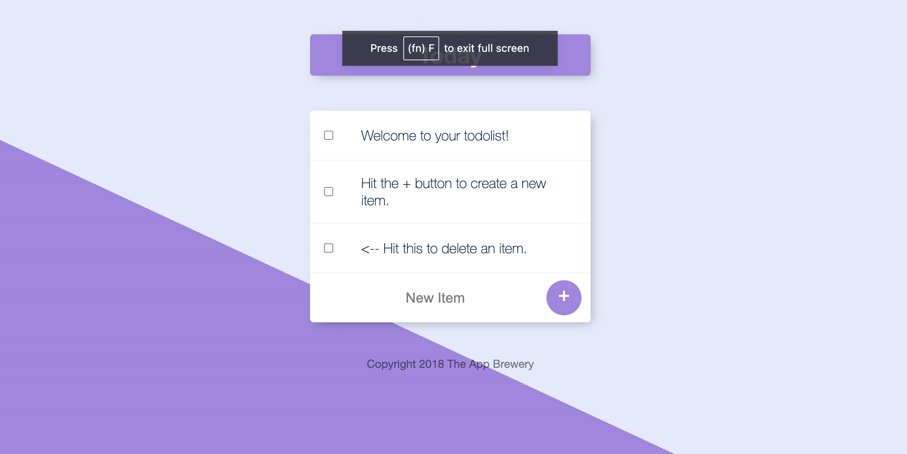
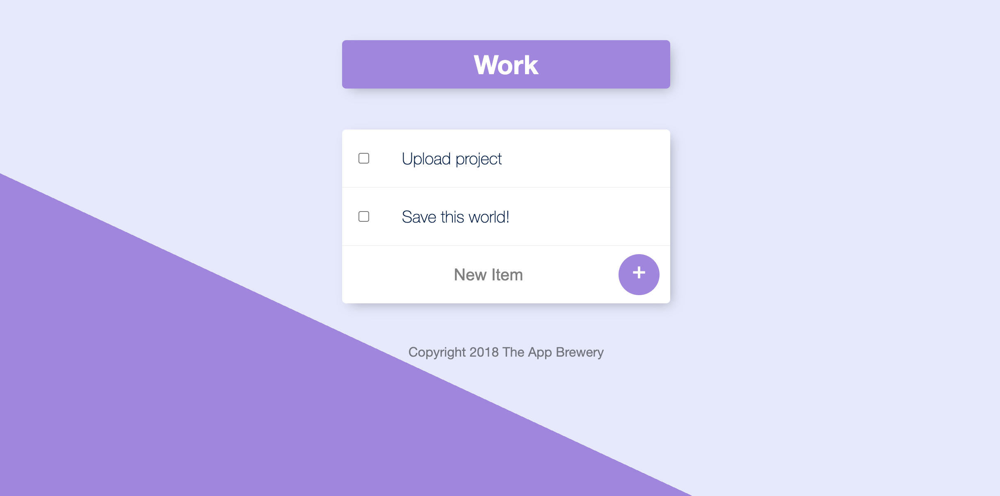

# To Do App

## Table of contents

- [Introduction](#introduction)
- [Demo](#demo)
- [Technology](#technology)
- [Features](#features)
- [Run](#run)

## Introduction

The first version of TodoList was developed, using Node and MongoDB.
Here you can plan and write your goals to achieve them. To order create a new list, just write in the URL-address the name of your list after "/".
“http://localhost:3000/<nameList>”
Example: “http://localhost:3000/work”

## Demo

## Technology

The main technologies used to build this application are:

- Node.js 
- MongoDB 
- Express.js 

## Features

A To Do App with the following features.

- View all list
- Create new list
- Move on existing list
- Create task
- Delete task

## Run

Open the root folder of the project and set your own environmental variables. For security reasons, some variables have been hidden from view and used as environmental variables with the help of dotenv package. Below are the variables that you need to set in order to run the server:

- MONGO_URL: this is the connection string of your MongoDB Atlas database.

After you've set these environmental variables in the .env file at the root of the server folder, run "npm install" to install dependencies

After that run command "node app.js" to start the app.
